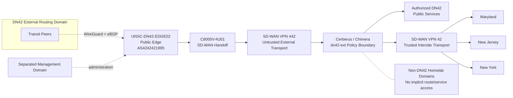

# UNSC Delta November 42 Service Enclave

| Metadata | Value |
|---|---|
| **Status** | Current |
| **Last Verified** | 2026-09-03 |
| **Applies To** | UNSC DN42-connected service enclave and its formal system-security documentation |
| **Source of Truth** | Current system-security documents, validated routing state, firewall architecture, and engineering change records in this repository |
| **Risk if Wrong** | Security-boundary, routing, service-exposure, or authorization assumptions may be applied incorrectly |
| **Owner** | System owner |
| **Follow-up Needed** | Complete planned public-service segments, Cybertron integration, and remaining service validation before treating those elements as operational |

## Introduction

UNSC Delta November 42 is a DN42-connected service enclave that provides controlled DNS, web, and supporting network services to the DN42 community while exercising secure interconnection, routing, boundary protection, and service-delivery practices.

The enclave connects to the DN42 routing domain through the public edge `UNSC-DN42-EDGE02` and uses separate untrusted external transport, firewall policy-enforcement boundaries, protected service zones, and trusted intersite transport.

## Background

The enclave exists to provide a realistic, security-conscious environment for operating services on DN42 and validating provider-routing and multi-site security architecture. It supports controlled public service delivery while preventing the external DN42 routing domain from becoming a path into unrelated household, production, management, or experimental networks.

The registered DN42 address space is used selectively. Native DN42 IPv4 is reserved for public services, peering identities, and required DN42-facing routing functions. Administrative and internal-only systems use private addressing and may use controlled NAT when consuming DN42 services.

The environment spans cloud-hosted routing and shared virtualized infrastructure at protected UNSC sites. External DN42 traffic is transported toward those sites through Catalyst SD-WAN and must cross an explicit Palo Alto `dn42-ext` security boundary before service access is permitted.

## Security Requirements

- DN42-originated traffic must traverse an explicit firewall policy-enforcement point before reaching an authorized service.
- SD-WAN VPN `442` is the untrusted DN42 external-to-enclave transport and must terminate in a `dn42-ext` firewall zone.
- SD-WAN VPN `42` is the separate trusted routed transport among NY, NJ, and MD.
- VPN `442` and VPN `42` must remain logically distinct and may only interact through deliberately designed security/routing boundaries.
- Routing reachability does not constitute authorization to access a service or another routing domain.
- DN42 traffic must not initiate sessions into MagmaNet, BlueLine, GreenLine, RedLine, household, management, or other non-DN42 homelab domains unless explicitly authorized by a documented design change.
- Administrative access to the public CHR must use the separated management path rather than DN42 service/client transport.
- External route advertisement is limited to prefixes registered to the POWOW95 DN42 identity.
- The enclave is authorized for public and lab-operational information supporting its services. It is not intended to process controlled information, credentials, production configurations, or management-plane data as application content.
- General documentation must not contain credentials, private keys, recovery codes, or other secret material.

Detailed mandatory requirements are maintained in [Security Requirements](docs/requirements.md).

## Enterprise Characteristics

| Area | Current implementation |
|---|---|
| Core services | Authoritative DNS, HTTPS web service, enclave-local Windows update distribution, and vulnerability assessment/reporting |
| End-user / service software | DN42-facing DNS and web services plus administrative and vulnerability-management tooling |
| Data-center / compute architecture | Cloud-hosted public routing edge with enclave workloads hosted as virtual machines on shared virtualization infrastructure |
| Network architecture | MikroTik CHR public edge, WireGuard/eBGP full-table peers, Catalyst SD-WAN VPN `442` and VPN `42`, BGP/OMP route transport, native DN42 public-service zones, and private/admin networks |
| Security stack | Palo Alto Cerberus and Chimera policy boundaries, `dn42-ext` zones, explicit service policy, route filtering, segmentation, NAT for private consumers where required, and management-path separation |
| Observability | Logging at defined routing and policy-enforcement points, network monitoring, route validation, vulnerability scanning, and retained incident evidence |
| Hardware / platforms | MikroTik CHR, Cisco C8000V/ISR SD-WAN nodes, Palo Alto physical/virtual firewalls, shared VMware virtualization, and supporting network infrastructure |
| Automation / management | RouterOS, Catalyst SD-WAN management, PAN-OS administration, GitHub configuration/security records, and validation workflows |

## Stakeholders

| Stakeholder | Relationship to the network |
|---|---|
| System owner / operator | Owns the enclave architecture, DN42 resources, security requirements, routing policy, service authorization, and operational records |
| DN42 service consumers | Use services intentionally published to the DN42 community |
| DN42 transit peers | Provide external routing reachability and BGP transit to the public edge |
| Supporting infrastructure operators | Maintain shared virtualization, firewall, WAN/SD-WAN, DNS/NTP, logging, monitoring, backup, and management services inherited by the enclave |
| Cloud / connectivity providers | Supply hosting and Internet transport used beneath the DN42 overlay and administrative connectivity |

## Additional Information

- Public DN42 edge: `UNSC-DN42-EDGE02`.
- Public ASN: `AS4242421995`.
- Registered IPv4 allocation: `172.23.105.192/27`.
- Registered IPv6 allocation: `fd16:2e38:95d2::/48`.
- Maryland `dn42-public`: `172.23.105.200/29` (planned).
- New Jersey `dn42-public`: `172.23.105.208/29` (planned).
- New York remains private/admin-only for IPv4 in the current design and uses controlled NAT when consuming DN42 services.
- `C8000V-NJ01` provides the CHR-to-SD-WAN handoff but is not the authoritative public DN42 origin router.
- The public edge currently maintains external WireGuard/eBGP transit and originates the registered IPv4 aggregate independently of downstream SD-WAN availability.
- Shared hypervisor, storage, management, backup, and recovery capabilities are supporting infrastructure rather than dedicated enclave components unless explicitly placed inside the system boundary.

## Design

This is the enclave-level trust and transport view. Detailed routing, addressing, data-flow, firewall, and service diagrams are maintained in the linked system documents.

## Documents

| Document | Purpose |
|---|---|
| [System Security Plan](docs/system-security-plan.md) | System description, security architecture, inherited controls, and control implementation summary |
| [System Boundary](docs/system-boundary.md) | Authorization boundary, included components, supporting infrastructure, and external dependencies |
| [Network Architecture](docs/network-architecture.md) | Current public edge, peerings, routing roles, SD-WAN transport, addressing, and isolation principles |
| [Public Edge Configuration](docs/public-edge-configuration.md) | Public CHR routing and policy baseline |
| [Addressing Plan](docs/addressing-plan.md) | Registered resources, public-service networks, transit addressing, and private/admin addressing model |
| [Data Flow Architecture](docs/data-flows.md) | Authorized traffic flows and trust transitions |
| [Security Requirements](docs/requirements.md) | Mandatory security, boundary, transport, service, and routing requirements |
| [Patch Management Architecture](docs/patch-management.md) | Enclave update-service and flaw-remediation design |
| [Engineering Change Log](CHANGELOG.md) | Material architecture and operational changes |
| [2026-08-26 DN42 Route Flap Incident](docs/incidents/2026-08-26-route-flap-postmortem.md) | AAR covering route churn, NEXT_HOP behavior, aggregate origination, and remediation |

## References

- [DN42 Resource Allocation Policy](https://www.dn42.dev/Policies)
- [DN42 Address Space](https://dn42.dev/Address-Space)
- [NIST SP 800-37 Rev. 2](https://csrc.nist.gov/pubs/sp/800-37/r2/final)
- [NIST SP 800-53 Rev. 5.2](https://csrc.nist.gov/pubs/sp/800-53/r5/upd1/final)
