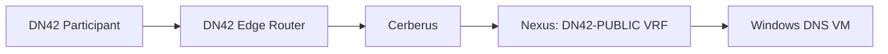
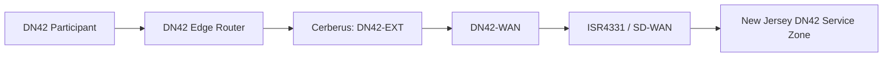

# Data Flow Architecture

## Flow DF-01: Authoritative DNS to Headquarters Service Zone

| Field | Definition |
|---|---|
| Source | Any DN42 participant |
| Destination | Authoritative DNS service in DN42-PUBLIC-HQ |
| Purpose | DNS resolution for enclave service names |
| Protocol | UDP 53 and TCP 53 |
| Direction | DN42 participant initiates; return traffic is statefully permitted |

### Path

Cerberus evaluates the requested service and protocol before allowing traffic from DN42-EXT to DN42-PUBLIC. The Nexus provides the destination service network gateway.

## Flow DF-02: Authoritative DNS to New Jersey Service Zone

| Field | Definition |
|---|---|
| Source | Any DN42 participant |
| Destination | Authoritative DNS service in DN42-PUBLIC-NJ |
| Purpose | DNS resolution for enclave service names hosted in New Jersey |
| Protocol | UDP 53 and TCP 53 |
| Direction | DN42 participant initiates; return traffic is statefully permitted |

### Path

Cerberus evaluates the requested service and protocol before allowing traffic from DN42-EXT to DN42-WAN. SD-WAN transports only the approved New Jersey DN42 service route. New Jersey service workloads are not granted access to unrelated enclave routing domains.
