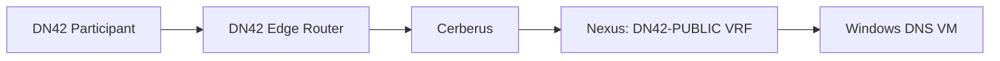
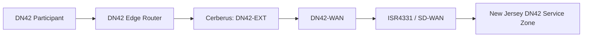

# Data Flow Architecture

## Flow DF-01: Authoritative DNS to Headquarters Service Zone

| Field | Definition |
|---|---|
| Source | Any DN42 participant |
| Destination | Authoritative DNS service in DN42-PUBLIC-HQ |
| Purpose | DNS resolution for enclave service names |
| Protocol | UDP 53 and TCP 53 |
| Direction | DN42 participant initiates; return traffic is statefully permitted |

### Path

Cerberus evaluates the requested service and protocol before allowing traffic from DN42-EXT to DN42-PUBLIC. The Nexus provides the destination service network gateway.

## Flow DF-02: Authoritative DNS to New Jersey Service Zone

| Field | Definition |
|---|---|
| Source | Any DN42 participant |
| Destination | Authoritative DNS service in DN42-PUBLIC-NJ |
| Purpose | DNS resolution for enclave service names hosted in New Jersey |
| Protocol | UDP 53 and TCP 53 |
| Direction | DN42 participant initiates; return traffic is statefully permitted |

### Path

Cerberus evaluates the requested service and protocol before allowing traffic from DN42-EXT to DN42-WAN. SD-WAN transports only the approved New Jersey DN42 service route. New Jersey service workloads are not granted access to unrelated enclave routing domains.

## Flow DF-03: GlobalProtect Administrative Access

| Field | Definition |
|---|---|
| Source | Authorized GlobalProtect administrative user |
| Destination | Approved DN42 administrative, public-service, WAN, and external-zone components |
| Purpose | System administration, validation, and troubleshooting |
| Protocol | Explicitly authorized management protocols only |
| Direction | Administrative session initiates; return traffic is statefully permitted |

The GlobalProtect gateway terminates in the DMZ. The tunnel interface is assigned to the DN42-VPN zone. Firewall policy permits DN42-VPN access only to approved DN42 administrative targets and defined operational components.

## Flow DF-04: WSUS Update Synchronization and Distribution

| Field | Definition |
|---|---|
| Source | DN42 WSUS service |
| Destination | Microsoft Update services through the approved update-egress domain |
| Purpose | Synchronize update metadata and download approved update content |
| Protocol | Authorized Microsoft Update protocols |
| Direction | WSUS initiates; return traffic is statefully permitted |

Enclave Windows workloads obtain approved update content from the local WSUS service. They are not authorized for direct Internet update access.

## Flow DF-05: Greenbone Vulnerability Scanning

| Field | Definition |
|---|---|
| Source | Greenbone service in DN42-ADMIN-HQ |
| Destination | Authorized DN42 administrative, public-service, and WAN-connected components |
| Purpose | Vulnerability identification and assessment |
| Protocol | Defined by approved scan profile |
| Direction | Greenbone initiates; return traffic is statefully permitted |

Greenbone is not authorized to scan DN42-EXT components or systems outside the enclave boundary.
