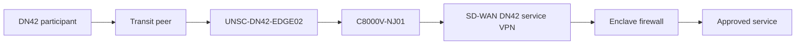
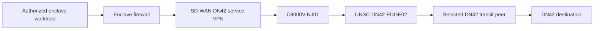

# Data Flow Architecture

## Flow DF-01: External DN42 Transit to Protected Enclave

| Field | Definition |
|---|---|
| Source | Any DN42 participant |
| Destination | Authorized service in the NY, MD, or cloud enclave |
| Purpose | Reach an approved DN42-published service |
| Direction | DN42 participant initiates; return traffic is statefully permitted |
| Enforcement | CHR route policy, explicit SD-WAN route exchange, and destination firewall policy |

### Target Path

The CHR handles only the public DN42 routing function. It is not a bypass around enclave policy. Any traffic entering a protected enclave must traverse the local firewall policy boundary.

## Flow DF-02: Enclave-Originated DN42 Traffic

| Field | Definition |
|---|---|
| Source | Authorized enclave workload |
| Destination | DN42 destination |
| Purpose | DN42 service consumption or controlled operational traffic |
| Direction | Enclave workload initiates; return traffic is statefully permitted |
| Route selection | Headscarf175, Kioubit, then iEdon local-preference order on the CHR |

### Target Path

The ordered peers use observed CHR underlay latency as a static preference input. The design is export-only for the registered aggregates and does not use the CHR as unrestricted learned-route transit.

## Flow DF-03: Administrative Access

Administrative access to the CHR uses the separated management path through NY102 and BlueLine SD-WAN VPN 300. The management interface is not used as the DN42 transport path or as a general default route for the dn42 VRF.
