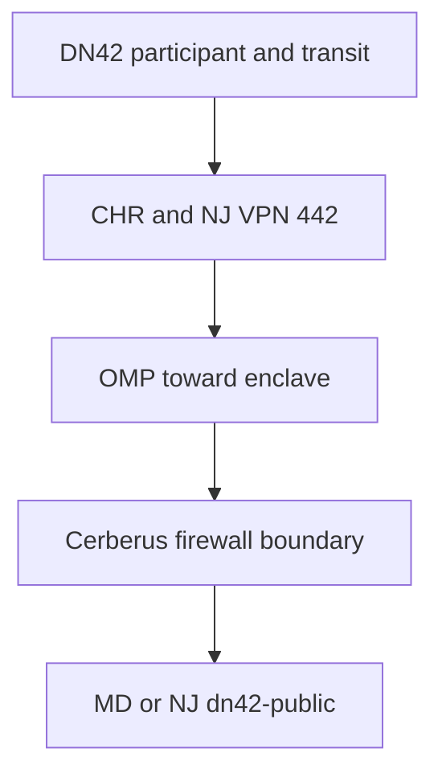

# Data Flow Architecture

## Current implementation status

External WireGuard/eBGP peerings on `UNSC-DN42-EDGE02` are operational. The CHR receives DN42 routes from Headscarf175, Kioubit, and iEdon. The CHR-to-NJ C8000V eBGP handoff is operational over `172.23.105.220/31`. VPN 442 OMP carriage to Maryland and the ISR4331-to-Cerberus eBGP handoff are also operational; Cerberus installed 1,359 active BGP routes through `172.23.105.192` during initial verification.

The addressing model now distinguishes public DN42 service networks from private/admin networks. MD and NJ retain native DN42-public service LANs. NY remains private/admin-only for IPv4 and uses NAT when private systems need to consume DN42 services.

## Flow DF-01: External DN42 Transit to Public Service

| Field | Definition |
|---|---|
| Source | Any DN42 participant |
| Destination | Authorized service in the MD or NJ `dn42-public` zone |
| Purpose | Reach an approved DN42-published service |
| Direction | DN42 participant initiates; return traffic is statefully permitted |
| Enforcement | CHR route policy, SD-WAN VPN 442, `dn42-ext` firewall policy, and destination service policy |

### Path

Public services use native DN42 IPv4. They are not published by translating an entire private service LAN. Firewall inspection and explicit policy remain mandatory before service access.

## Flow DF-02: Private/Admin Workload Consuming DN42

| Field | Definition |
|---|---|
| Source | Authorized private/admin workload |
| Destination | DN42 destination |
| Purpose | Consume DN42 services without assigning native DN42 IPv4 to the client network |
| Addressing | Private IPv4 on the source segment; NAT at the DN42-facing boundary |
| Route selection | CHR transit policy after traffic enters the DN42 routing domain |

### Path

This is the normal IPv4 model for New York. NY does not receive a native `dn42-public` `/29` in the current design.

## Flow DF-03: Trusted Intersite Communication

| Field | Definition |
|---|---|
| Source | Authorized NY, NJ, or MD enclave workload |
| Destination | Authorized workload at another approved site |
| Purpose | Direct intersite communication |
| Transport | SD-WAN VPN 42 |
| Trust classification | Trusted intersite transport |
| Enforcement | Firewall inspection where a security boundary is crossed |

### Path

VPN 42 prevents the intersite design from depending on one location as a hub. Trusted transport does not remove inspection requirements at security boundaries.

## Flow DF-04: Administrative Access

Administrative access to the CHR uses the separated management path through NY102 and BlueLine SD-WAN VPN 300. The management interface is not used as the DN42 transport path or as a general default route for the `dn42` VRF.

DN42 administrative/client networks use private IPv4 rather than consuming native DN42 IPv4 merely for management reachability.
