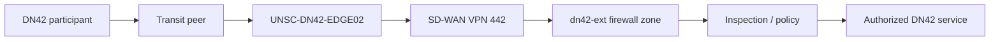
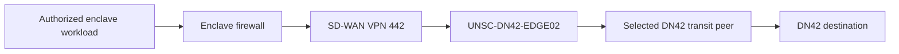
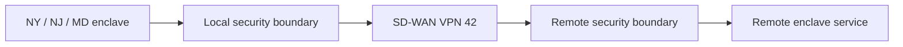

# Data Flow Architecture

## Flow DF-01: External DN42 Transit to Protected Enclave

| Field | Definition |
|---|---|
| Source | Any DN42 participant |
| Destination | Authorized DN42 service in a protected enclave |
| Purpose | Reach an approved DN42-published service |
| Direction | DN42 participant initiates; return traffic is statefully permitted |
| Enforcement | CHR route policy, SD-WAN VPN 442, `dn42-ext` firewall policy, and destination service policy |

### Path

VPN 442 is the untrusted DN42 external-to-enclave transport. External DN42 traffic does not enter a protected enclave without traversing the applicable `dn42-ext` firewall boundary. Cerberus and Chimera provide this policy boundary for their respective protected environments.

## Flow DF-02: Enclave-Originated DN42 Traffic

| Field | Definition |
|---|---|
| Source | Authorized DN42 enclave workload |
| Destination | DN42 destination |
| Purpose | DN42 service consumption or controlled operational traffic |
| Direction | Enclave workload initiates; return traffic is statefully permitted |
| Route selection | Headscarf175, Kioubit, then iEdon local-preference order on the CHR |

### Path

The ordered transit peers use observed CHR underlay latency as a static preference input. The CHR is not used as unrestricted learned-route transit.

## Flow DF-03: Trusted Intersite DN42 Communication

| Field | Definition |
|---|---|
| Source | Authorized NY, NJ, or MD enclave workload |
| Destination | Authorized workload at another approved site |
| Purpose | Direct intersite DN42 enclave communication |
| Transport | SD-WAN VPN 42 |
| Trust classification | Trusted intersite transport |
| Enforcement | Firewall inspection where a security boundary is crossed |

### Path

VPN 42 prevents the intersite design from depending on one location as a hub. Trusted transport does not remove inspection requirements at security boundaries.

## Flow DF-04: Administrative Access

Administrative access to the CHR uses the separated management path through NY102 and BlueLine SD-WAN VPN 300. The management interface is not used as the DN42 transport path or as a general default route for the `dn42` VRF.
