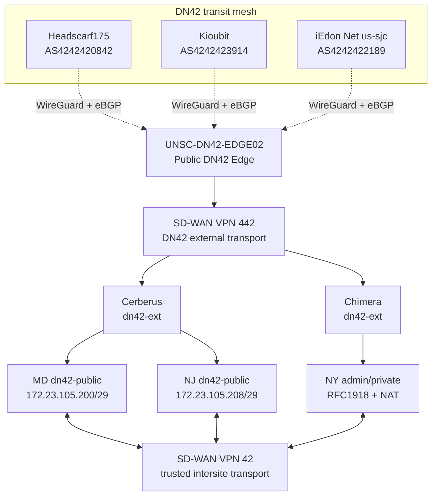

# Network Architecture

## Current State

`UNSC-DN42-EDGE02`, a MikroTik CHR in Vultr New Jersey, is the operational public DN42 edge. It maintains three established WireGuard/eBGP full-table peers in the `dn42` VRF.

The registered IPv4 allocation remains `172.23.105.192/27`. After review of DN42 IPv4 allocation policy, the enclave no longer treats native DN42 IPv4 as general-purpose addressing for every routed or administrative segment. DN42 IPv4 is concentrated on public service zones, peering identities, and selected DN42-facing transit links. Administrative and client networks use private IPv4 and may use NAT when they need to consume DN42 services.

The CHR-to-NJ C8000V eBGP handoff is operational over `172.23.105.220/31`. The C8000V advertises the DN42 table into OMP for VPN 442, the MD ISR4331 redistributes the routes to eBGP, and Cerberus installed 1,359 active BGP routes through `172.23.105.192` during initial verification. The owned `/27` remains intentionally unoriginated until the VPN 42 return side and downstream public-service routes exist. IPv6 enclave implementation is deferred.

Policy reference: https://www.dn42.dev/Policies

## Logical Architecture

## Routing Roles

| Component | Responsibility |
|---|---|
| `UNSC-DN42-EDGE02` | Public WireGuard and eBGP edge, DN42 path selection, and registered-prefix origination when downstream service reachability exists |
| Headscarf175, Kioubit, iEdon | External full-table DN42 transit peers |
| SD-WAN VPN `442` | Untrusted DN42 transport from the external DN42 domain toward protected enclaves |
| Cerberus `dn42-ext` and internal DN42 zones | eBGP termination, inspection, and controlled route transfer between VPN 442 and VPN 42 |
| Chimera `dn42-ext` zone | Firewall termination and policy enforcement for NY DN42 access |
| SD-WAN VPN `42` | Trusted routed communication among NY, NJ, and MD without hub dependence |
| MD and NJ `dn42-public` zones | Native DN42 IPv4 public-service networks |
| NY admin/private zone | Private IPv4; DN42 consumption through NAT where required |

## IPv4 Architecture

| Prefix / address | Function | State |
|---|---|---|
| `172.23.105.192/31` | MD ISR4331 ↔ Cerberus VPN 442 transit | Operational |
| `172.23.105.194/31` | MD Cerberus ↔ ISR4331 VPN 42 transit | Planned / in progress |
| `172.23.105.196/31` | NY edge ↔ Chimera DN42-facing/NAT transit | Planned |
| `172.23.105.198/31` | Cerberus ↔ Nexus public-service handoff | Planned |
| `172.23.105.200/29` | MD `dn42-public` | Planned |
| `172.23.105.208/29` | NJ `dn42-public` | Planned |
| `172.23.105.219/32` | CHR peering identity | Operational |
| `172.23.105.220/31` | CHR ↔ C8000V-NJ01 transit | Operational |
| `172.23.105.222` | CHR BGP router ID | Operational identifier |

The design consumes 27 of the 32 IPv4 addresses for routed/public functions. New York does not receive a native `dn42-public` `/29`; its administrative/private systems use private IPv4 and NAT when accessing DN42.

## Public Edge Policy

The CHR export policy permits only prefixes currently registered to POWOW95. `172.23.105.192/27` is the only registered POWOW95 IPv4 allocation in the current architecture. `fd16:2e38:95d2::/48` remains registered for IPv6.

The CHR does not export arbitrary learned routes or provide unrestricted transit. For CHR-originated DN42 traffic, local preference is ordered Headscarf175, Kioubit, then iEdon based on measured Vultr underlay RTT.

## SD-WAN Security Roles

### VPN 442

VPN `442` is the DN42 external-to-enclave transport. Traffic carried in VPN 442 is untrusted and must terminate in a `dn42-ext` firewall zone before entering a protected enclave or public-service zone. Routing reachability over VPN 442 does not itself authorize service access.

### VPN 42

VPN `42` is the trusted intersite routing service among NY, NJ, and MD. Trusted transport does not bypass firewall inspection where traffic crosses a security boundary.

## Isolation Principles

1. The WireGuard Internet underlay remains separate from the DN42 routing domain.
2. DN42 IPv4 is assigned to public DN42 services and required DN42-facing routing functions, not automatically to all enclave segments.
3. Administrative and client networks use private IPv4 and may NAT when consuming DN42 services.
4. MD and NJ maintain native DN42-public IPv4 service zones.
5. NY remains private/admin-only for IPv4 in the current design.
6. VPN 442 carries external DN42 traffic only into explicit `dn42-ext` policy boundaries.
7. VPN 42 provides trusted intersite routing but does not bypass firewall inspection.
8. DN42 routes are not implicitly leaked into BlueLine, GreenLine, RedLine, management, household, or other non-DN42 domains.
