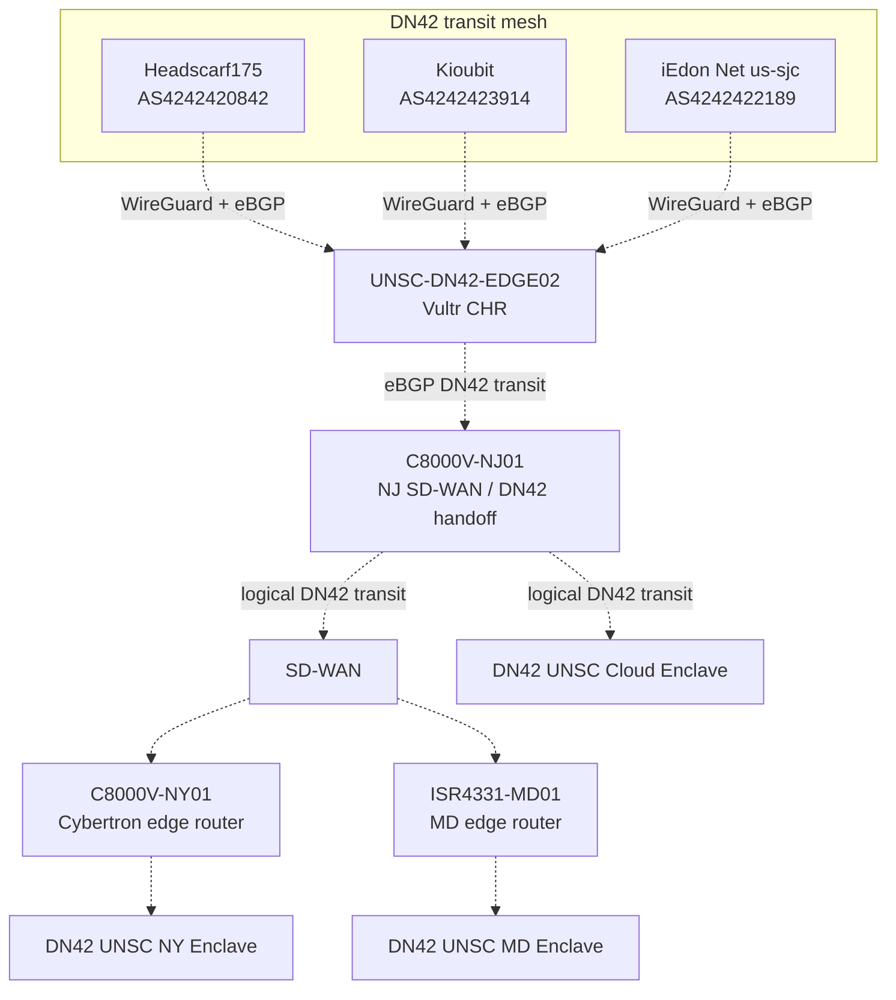

# Network Architecture

## Status

The Vultr CHR is operational as the public DN42 edge. The CHR-to-C8000V-NJ01 eBGP handoff and SD-WAN extension are the next implementation phase.

## Logical Architecture

## Routing Roles

| Component | Status | Responsibility |
|---|---|---|
| UNSC-DN42-EDGE02 | Operational | Public WireGuard and eBGP edge in Vultr, DN42 route selection, and approved aggregate origination |
| Headscarf175, Kioubit, iEdon | Operational | Full-table eBGP transit peers |
| C8000V-NJ01 | Planned handoff | eBGP neighbor to the CHR and DN42 route carriage into the SD-WAN service VPN |
| SD-WAN | Planned DN42 extension | Controlled transport to approved enclaves |
| C8000V-NY01 and ISR4331-MD01 | Planned DN42 edge roles | Enclave access through their local routing and firewall boundaries |
| Enclave firewalls | Current and planned policy boundary | Inspect and explicitly authorize traffic entering protected services |

## Public Edge Policy

UNSC-DN42-EDGE02 originates only the registered aggregates:

- 172.23.105.192/26
- fd16:2e38:95d2::/48

It does not export arbitrary learned routes or provide unrestricted transit. Route selection for CHR-originated traffic uses higher local preference for Headscarf175, then Kioubit, then iEdon. This ranking reflects the measured Vultr underlay RTT at the time of deployment and is not a per-destination measurement system.

The existing home C8000V DN42 path remains a later fallback design after the CHR-to-C8000V-NJ01 interconnection is built. Until then, it is documented as a separate legacy deployment rather than an active part of the CHR transport path.

## Isolation Principles

1. WireGuard Internet underlay remains separate from the DN42 routing domain.
2. DN42 route exchange into SD-WAN is explicit and limited to the DN42 service VPN.
3. Protected NY, MD, and cloud enclave traffic must cross the applicable firewall policy boundary.
4. DN42 routes are not implicitly leaked into BlueLine, GreenLine, RedLine, management, or other non-DN42 domains.
