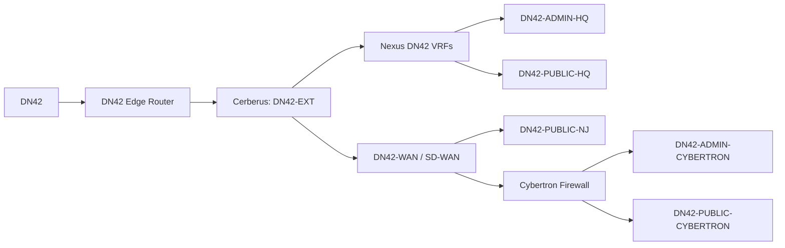

# Network Architecture

## Architecture Overview

## Routing Roles

| Component | Responsibility |
|---|---|
| DN42 edge router | External DN42 peering and approved aggregate advertisement |
| Cerberus | Security policy enforcement between external, service, and WAN domains |
| Nexus | Default gateway and VRF routing for headquarters DN42 service domains |
| SD-WAN | Approved transport for DN42 route exchange between sites |
| Cybertron firewall | Default gateway and policy enforcement for Cybertron DN42 service domains |

## Route Exchange Principles

1. Headquarters administrative and public-service VRFs use dedicated eBGP handoffs to Cerberus.
2. Cerberus exports and imports only approved DN42 service and transport routes.
3. The DN42 edge advertises only the approved aggregate to external DN42 peers.
4. SD-WAN carries DN42 routes only between explicitly authorized sites.
5. No implicit route leaking is permitted between DN42 and non-DN42 routing domains.
