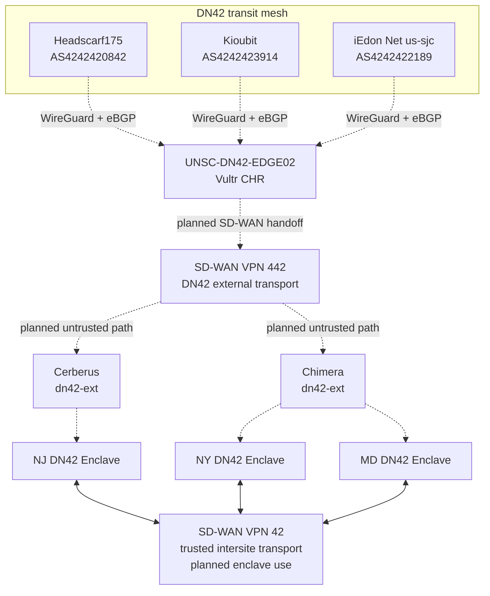

# Network Architecture

## Current State

`UNSC-DN42-EDGE02`, a MikroTik CHR in Vultr New Jersey, is the operational public DN42 edge. It maintains three established WireGuard/eBGP full-table peers in the `dn42` VRF.

The current registered IPv4 transit prefix is `172.23.105.192/27`. The CHR ownership list is corrected to that exact prefix. The CHR-to-NJ C8000V eBGP handoff is operational over `172.23.105.220/31`, and the C8000V receives the DN42 table in VPN 442. The prefix remains intentionally unoriginated until the remaining OMP, firewall, and downstream service route exist. A separate `172.23.46.0/26` service-network request is pending in DN42 registry PR #7253 and is not originated until that allocation is merged. IPv6 enclave implementation is deferred.

## Logical Architecture



## Confirmed SD-WAN and Firewall Path

The planned external-to-internal path is:

```text
DN42 -> CHR -> C8000V-NJ VPN 442 -> OMP
     -> ISR4331 VPN 442 -> eBGP
     -> Cerberus -> eBGP
     -> ISR4431 VPN 42 -> OMP
     -> C8000V-NJ VPN 42
```

Cerberus is the deliberate policy and routing handoff between the two SD-WAN service VPNs. Direct native route leaking between VPN 442 and VPN 42 is not part of the design. Cerberus uses one virtual router for both BGP interfaces. The interfaces remain in distinct security zones so the transfer is subject to explicit interzone inspection.

SD-WAN site IDs are MD `12`, NJ `102`, and NY `100`.

## ASN Scheme

Internal eBGP uses private 32-bit ASNs in the format `4200SSSVVV`. `SSS` is the zero-padded site ID, `VVV` is the zero-padded VPN ID, and `000` represents a shared site firewall routing process.

| Routing process | ASN |
|---|---:|
| Public CHR | `4242421995` |
| NJ C8000V VPN 442 | `4200102442` |
| NJ C8000V VPN 42 | `4200102042` |
| MD ISR4331 VPN 442 | `4200012442` |
| MD Cerberus shared virtual router | `4200012000` |
| MD ISR4431 VPN 42 | `4200012042` |
| NY SD-Edge VPN 42 | `4200100042` |

The distinct edge ASN for each site and service VPN prevents the same local ASN from appearing on both sides of the Cerberus handoff. Cerberus uses one ASN because PAN-OS BGP is scoped to the shared virtual router.

These are enclave-private ASNs, not additional DN42 registry ASNs. Only the CHR presents registered `AS4242421995` to public DN42 peers.

Existing SD-WAN BGP processes are retained. `c8000v-ny01` currently runs global `AS6420533`, and `isr4331-md01` runs global `AS65302`. Their DN42 eBGP neighbors use `local-as ... no-prepend replace-as` so the enclave-facing peer sees the assigned `4200SSSVVV` ASN without exposing or changing the router's existing global ASN. The NJ C8000V currently has no BGP process; its BGP process and applicable DN42 address families will be created with the SD-WAN handoff.

## Routing Roles

| Component | Responsibility |
|---|---|
| `UNSC-DN42-EDGE02` | Public WireGuard and eBGP edge in Vultr, DN42 path selection, and planned registered-prefix origination |
| Headscarf175, Kioubit, iEdon | External full-table DN42 transit peers |
| SD-WAN VPN `442` | Untrusted DN42 transport from the external DN42 domain toward protected enclaves |
| Cerberus `dn42-ext` and internal DN42 zones | eBGP termination, inspection, and controlled route transfer between VPN 442 and VPN 42 |
| Chimera `dn42-ext` zone | Firewall termination, inspection, and authorization for VPN 442 ingress |
| SD-WAN VPN `42` | Trusted routed communication among NY, NJ, and MD without hub dependence |
| Enclave firewall boundaries | Inspection and policy enforcement before traffic reaches protected services or crosses security boundaries |

## Public Edge Policy

The CHR export policy permits only prefixes currently registered to POWOW95.

Current active POWOW95 prefix advertisements from the CHR: none.

- `172.23.105.192/27` is registered and configured in the CHR ownership list, but lacks the downstream route required for origination.
- `fd16:2e38:95d2::/48` is registered, but IPv6 enclave carriage and origination are deferred.
- `172.23.46.0/26` is a service-network request and is not considered active until DN42 registry PR #7253 merges.

Current infrastructure assignments are `172.23.105.219` for the iEdon peering and `172.23.105.222` for the CHR BGP router ID. The operational CHR-to-C8000V transit is `172.23.105.220/31`, with `.220` on the CHR and `.221` on C8000V interface Gi4.

The CHR does not export arbitrary learned routes or provide unrestricted transit. For future CHR-originated DN42 traffic, local preference is ordered Headscarf175, Kioubit, then iEdon based on measured Vultr underlay RTT.

The CHR remains attached to the shared Vultr `DMZ` firewall group by operator decision. That upstream firewall filters traffic arriving on the public Internet interface; RouterOS routing-domain and policy controls govern decrypted DN42 traffic.

## SD-WAN Security Roles

### VPN 442

VPN `442` is the DN42 external-to-enclave transport. The CHR-to-NJ C8000V eBGP handoff is operational, with 1,353 received prefixes observed during initial verification. The OMP continuation, Maryland firewall handoff, and end-to-end VPN 442 path remain in progress. Traffic carried in VPN 442 is untrusted and must terminate in a `dn42-ext` firewall zone before entering a protected enclave. Both Cerberus and Chimera provide this boundary.

Routing reachability over VPN 442 does not itself authorize access to a service.

### VPN 42

VPN `42` is the intended trusted intersite routing service among NY, NJ, and MD. Its purpose is to allow the sites to communicate directly without forcing one site to operate as a hub.

The transport is trusted relative to external DN42 ingress, but firewall inspection still applies wherever traffic crosses a security boundary.

## Isolation Principles

1. The WireGuard Internet underlay remains separate from the DN42 routing domain.
2. VPN 442 carries external DN42 traffic only into explicit `dn42-ext` policy boundaries.
3. VPN 42 provides trusted intersite routing but does not bypass firewall inspection.
4. DN42 routes are not implicitly leaked into BlueLine, GreenLine, RedLine, management, household, or other non-DN42 domains.
5. Transit addressing and service addressing remain separate.
