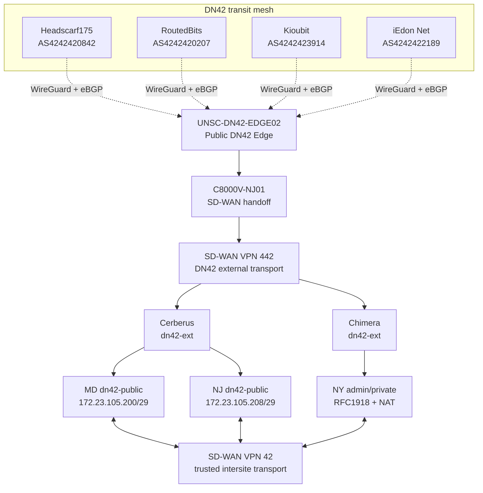

# Network Architecture

## Current State

`UNSC-DN42-EDGE02`, a MikroTik CHR in Vultr New Jersey, is the operational public DN42 edge. It maintains four established WireGuard/eBGP full-table peers in the `dn42` VRF: Headscarf175, RoutedBits, Kioubit, and iEdon.

The registered IPv4 allocation remains `172.23.105.192/27`. After review of DN42 IPv4 allocation policy, the enclave no longer treats native DN42 IPv4 as general-purpose addressing for every routed or administrative segment. DN42 IPv4 is concentrated on public service zones, peering identities, and selected DN42-facing transit links. Administrative and client networks use private IPv4 and may use NAT when they need to consume DN42 services.

The CHR-to-`C8000V-NJ01` eBGP handoff is operational over `172.23.105.220/31`. `C8000V-NJ01` imports the DN42 table into SD-WAN VPN 442 for controlled transport toward enclave security boundaries. It is not the authoritative public DN42 origin router.

The CHR originates `172.23.105.192/27` as `AS4242421995`. Following the 2026-08-26 route-flap incident, aggregate origination is anchored independently of the internal C8000V forwarding path. Public BGP peers receive the CHR itself as NEXT_HOP where applicable, including RFC 8950 Extended Next Hop for IPv4 NLRI carried over IPv6-link-local BGP sessions.

The current public-edge routing and control baseline is documented in [Public Edge Configuration](public-edge-configuration.md). The route-flap investigation is documented in [2026-08-26 DN42 Route Flap Incident](incidents/2026-08-26-route-flap-postmortem.md).

Policy reference: https://www.dn42.dev/Policies

## Logical Architecture

## Routing Roles

| Component | Responsibility |
|---|---|
| `UNSC-DN42-EDGE02` | Authoritative public WireGuard/eBGP edge, DN42 path selection, stable registered-prefix origination, and public NEXT_HOP control |
| Headscarf175, RoutedBits, Kioubit, iEdon | External full-table DN42 transit peers |
| `C8000V-NJ01` | Internal CHR-to-SD-WAN handoff for DN42 route transport toward the enclave |
| SD-WAN VPN `442` | Untrusted DN42 transport from the external DN42 domain toward protected enclaves |
| Cerberus `dn42-ext` and internal DN42 zones | eBGP termination, inspection, and controlled route transfer between VPN 442 and VPN 42 |
| Chimera `dn42-ext` zone | Firewall termination and policy enforcement for NY DN42 access |
| SD-WAN VPN `42` | Trusted routed communication among NY, NJ, and MD without hub dependence |
| MD and NJ `dn42-public` zones | Native DN42 IPv4 public-service networks |
| NY admin/private zone | Private IPv4; DN42 consumption through NAT where required |

## Device Naming Note

The production environment contains multiple C8000V routers. Documentation uses exact hostnames rather than generic labels such as "the C8000V" or "legacy C8000V."

- `C8000V-MD02` is the original home/Maryland public DN42 edge that terminated the GRE/BGP peering toward iEdon.
- `C8000V-MD01` is a separate router: the former Maryland SD-WAN edge, replaced in that role by `c4331-md01` (ISR4331).
- `C8000V-NJ01` is the New Jersey SD-WAN handoff used by the CHR.

## IPv4 Architecture

| Prefix / address | Function | State |
|---|---|---|
| `172.23.105.192/31` | MD ISR4331 ↔ Cerberus VPN 442 transit | Operational |
| `172.23.105.194/31` | MD Cerberus ↔ ISR4331 VPN 42 transit | Operational |
| `172.23.105.196/31` | Historical `C8000V-MD02` ↔ Cerberus direct DN42 handoff | Public-edge path retired |
| `172.23.105.198/31` | Cerberus ↔ Nexus public-service handoff | Planned |
| `172.23.105.200/29` | MD `dn42-public` | Planned |
| `172.23.105.208/29` | NJ `dn42-public` | Planned |
| `172.23.105.219/32` | CHR iEdon peering identity | Operational |
| `172.23.105.220/31` | CHR ↔ `C8000V-NJ01` transit | Operational |
| `172.23.105.222` | CHR BGP router ID | Operational identifier |

The design consumes DN42 IPv4 primarily for routed/public functions. New York does not receive a native `dn42-public` `/29`; its administrative/private systems use private IPv4 and NAT when accessing DN42.

## Public Edge Policy

The CHR export policy permits only prefixes currently registered to POWOW95. `172.23.105.192/27` is the registered POWOW95 IPv4 allocation in the current architecture. `fd16:2e38:95d2::/48` remains registered for IPv6.

Inbound preference is intentionally ordered by LOCAL_PREF:

1. Headscarf175: 400
2. RoutedBits: 300
3. Kioubit: 200
4. iEdon: 100

Outbound IPv4 AS_PATH policy is intentionally ordered:

1. Headscarf175: no additional prepend
2. RoutedBits: two copies of `4242421995` in the resulting advertised path
3. Kioubit: three copies
4. iEdon: four copies

These policies influence path preference only. They are not used as a substitute for stable route origination or correct NEXT_HOP behavior.

## SD-WAN Security Roles

### VPN 442

VPN `442` is the DN42 external-to-enclave transport. Traffic carried in VPN 442 is untrusted and must terminate in a `dn42-ext` firewall zone before entering a protected enclave or public-service zone. Routing reachability over VPN 442 does not itself authorize service access.

### VPN 42

VPN `42` is the trusted intersite routing service among NY, NJ, and MD. Trusted transport does not bypass firewall inspection where traffic crosses a security boundary.

## Isolation Principles

1. The WireGuard Internet underlay remains separate from the DN42 routing domain.
2. Public prefix origination on `UNSC-DN42-EDGE02` is independent of downstream SD-WAN-router availability.
3. External BGP NEXT_HOP is validated per peer before production acceptance.
4. DN42 IPv4 is assigned to public DN42 services and required DN42-facing routing functions, not automatically to all enclave segments.
5. Administrative and client networks use private IPv4 and may NAT when consuming DN42 services.
6. VPN 442 carries external DN42 traffic only into explicit `dn42-ext` policy boundaries.
7. VPN 42 provides trusted intersite routing but does not bypass firewall inspection.
8. DN42 routes are not implicitly leaked into BlueLine, GreenLine, RedLine, management, household, or other non-DN42 domains.
