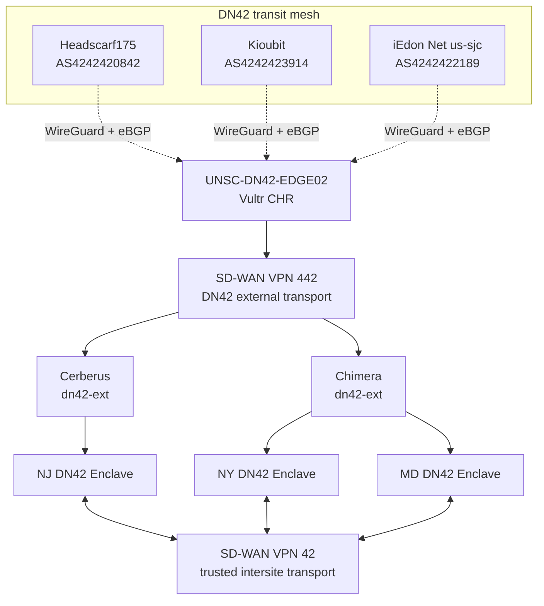

# Network Architecture

## Current State

`UNSC-DN42-EDGE02`, a MikroTik CHR in Vultr New Jersey, is the operational public DN42 edge. It maintains three live WireGuard/eBGP full-table peers and originates only registered POWOW95 DN42 prefixes.

The current registered IPv4 transit prefix is `172.23.105.192/27`. A separate `172.23.46.0/26` service-network request is pending in DN42 registry PR #7253 and is not originated until that allocation is merged.

## Logical Architecture

## Routing Roles

| Component | Responsibility |
|---|---|
| `UNSC-DN42-EDGE02` | Public WireGuard and eBGP edge in Vultr, DN42 path selection, and registered-prefix origination |
| Headscarf175, Kioubit, iEdon | External full-table DN42 transit peers |
| SD-WAN VPN `442` | Untrusted DN42 transport from the external DN42 domain toward protected enclaves |
| Cerberus and Chimera `dn42-ext` zones | Firewall termination, inspection, and authorization for VPN 442 ingress |
| SD-WAN VPN `42` | Trusted routed communication among NY, NJ, and MD without hub dependence |
| Enclave firewall boundaries | Inspection and policy enforcement before traffic reaches protected services or crosses security boundaries |

## Public Edge Policy

The CHR originates only prefixes currently registered to POWOW95.

Current registered advertisements include:

- `172.23.105.192/27`
- `fd16:2e38:95d2::/48`

`172.23.46.0/26` is a service-network request and is not considered an active registered advertisement until DN42 registry PR #7253 merges.

The CHR does not export arbitrary learned routes or provide unrestricted transit. For CHR-originated DN42 traffic, local preference is ordered Headscarf175, Kioubit, then iEdon based on measured Vultr underlay RTT.

## SD-WAN Security Roles

### VPN 442

VPN `442` is the DN42 external-to-enclave transport. Traffic carried in VPN 442 is untrusted and must terminate in a `dn42-ext` firewall zone before entering a protected enclave. Both Cerberus and Chimera provide this boundary.

Routing reachability over VPN 442 does not itself authorize access to a service.

### VPN 42

VPN `42` provides trusted intersite routing among NY, NJ, and MD. Its purpose is to allow the sites to communicate directly without forcing one site to operate as a hub.

The transport is trusted relative to external DN42 ingress, but firewall inspection still applies wherever traffic crosses a security boundary.

## Isolation Principles

1. The WireGuard Internet underlay remains separate from the DN42 routing domain.
2. VPN 442 carries external DN42 traffic only into explicit `dn42-ext` policy boundaries.
3. VPN 42 provides trusted intersite routing but does not bypass firewall inspection.
4. DN42 routes are not implicitly leaked into BlueLine, GreenLine, RedLine, management, household, or other non-DN42 domains.
5. Transit addressing and service addressing remain separate.
